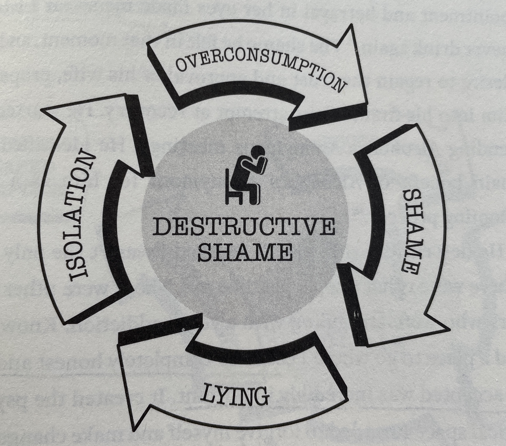
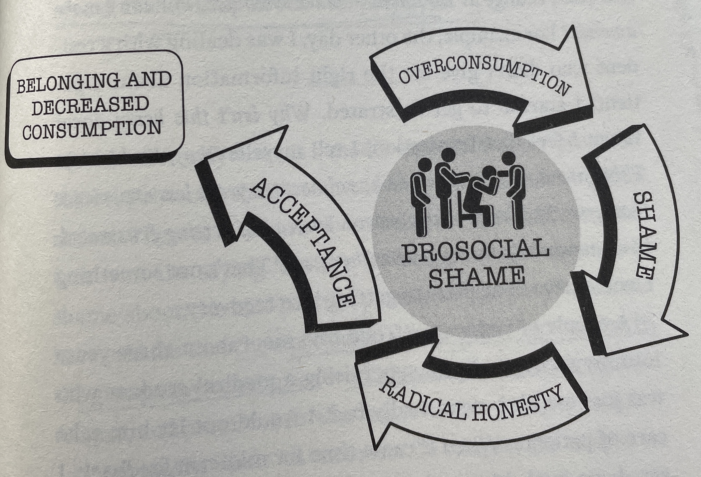

# Part 3: The Pursuit of Pain

## Chapter 7: Pressing on the Pain Side
The same way that stimulating the pleasure and reward pathways triggers the body to manufacture a pain response, stimulating the pain and fear pathways triggers the body to generate a pleasure response. One of the key differences in these responses is that "the dopamine that comes from pain is indirect and potentially more enduring."

This does not mean that everyone should go out and only seek pain, but intermittent exposure to pain stimuli over time will naturally weight the pleasure-pain balance to side of pleasure. In the 1960s an experiment in which dogs were repeatedly exposed to painful electric shocks. Initially, their response was panic, but over time it morphed into hypervigilance, and eventually a "fit of joy." The initial biological responses, like a panicked mood and increased heart rate, abated and adapted to the situation.

Repeated exposure to stress has been shown to lead to increased dopamine production in the brain's reward pathways. However, the scale can tip too far, just as it can with repeated, prolonged exposure to pleasure stimuli, resulting in an inability to enjoy regular experience, a phenomenon known as **anhedonia.**

### The Science of Hormesis
Hormesis is phenomenon in which exposing living creatures to small doses of controlled noxious and/or painful stimuli results in increased resilience. The word stems from the Greek *hormáein:* to set in motion, impel, urge on. These hardships can be most anything, but a few examples are cold, heat, gravitational changes, radiation, food restriction, and exercise.

### What About Exercise?
Exercise in immediately toxic to cells. It increases temperature, introduces noxious oxidants, and creates a state of oxygen and glucose deficit. At the same time, exercise is a pillar of a healthy lifestyle and regular participation in exercise increases the neurotransmitters involved in positive mood regulation: dopamin, serotonin, norepinephrine, epinephrine, endocannabinoids, and endogenous opioid peptides (endorphins). Exercise also contributes to the birth on new neurons.

In today's easy-access, high-dopamine rich world, movement is no longer necessary to get our fix, and as a result we spend 50% more time sitting than we did 50 years ago. And yet, exercise is the single more important factor in regulating mood, anxiety, cognition, energy, and sleep, with an impact far outweighing any modern medicine.

### Addicted to Work
The landscape of the work world have changed drastically over the last century, with many white collar jobs becoming overly wrought with incentives and blue collar jobs becoming more mechanized, piecemeal, and devoid of accomplishment. Lembke argues that "the result is a 'work-hard/play-hard' mentality in which *compulsive overconsumption' becomes the reward at the end of a day of drudgery."

### Conclusion
Similar to the constant pursuit of pleasure, the constant pursuit of pain can lead to "compulsive, destructive overconsumption." Consuming the right amount of pain leads to increased pleasure and hormetic healing.

## Chapter 8: Radical Honest
Truth-telling, also known in modern parlance as **radical honesty** is a pillar in both establishing and maintaining sustained mental and physical health. Despite this fact we learn to lie at an early age, as early as two years old, developing more complex and profound lies as we age and social connections becomes more complicated. And lying often becomes a habit, extending itself to minor and major things alike. Radical honest on the other hand fosters "awareness of our actions" and "intimate human connections" by allowing us to have a "truthful autobiography."

### Awareness
Denial is the manifestation of a disconnect between the reward pathways and the higher cortical functions in the brain. The prefrontal cortex is where all of our decision-making and emotional regulation occurs, along with the story we tell ourselves. It has been shown that stimulation of the prefrontal cortex results in increased honesty in day to day life, and vice versa. Honesty, and in turn awareness, eliminate the cognitive dissonance introduced during lying and allow for mastery over our actions.

### Intimate Human Connections
It is commonly thought that when our character flaws and transgressions are rooted out the tribe will eschew the individual, creating distance. The reality is more often than not the opposite. Honest disclosure and vulnerability foster a stronger bond, and intimacy releases oxytocin, a powerful hormone related to falling in love, mother-child bonding, and lifetime pair bonding.

Compulsive overconsumption in diametrically opposed to intimacy, often leading to isolation and indifference and serving as a replacement for the rewards obtained from relationships with others.

Additionally, truth-telling creates a "plenty mindset" amongst the  tribe in which safety and intimacy can flourish. Lies do the opposite, create a "scarcity mindset" in which the future is perceived to be unstable and the world a dangerous place, often fostering a "competitive survival mode." 

### Truthful Autobiographies
The age of social media has magnified and accelerated a world in which there is often a divergence between the true self and the projected self, in which the latter exposes only an individual's best version of their self. This divergence creates a detachment that ultimately leads to a "profound emptiness," the antidote to which is a return to the "authentic self."

## Chapter 9: Prosocial Shame
Shame and guilt are two different, albeit similar, emotions. **Shame** occurs when we feel bad about ourselves as people and is maladaptive, whereas **guilt** make us feel bad about our actions and is adaptive. That is not to say that the experience of shame and guilt are not incredibly similar, but guilt incorporates the perception of others and ultimately culminates in a primal fear of being cast out of the tribe and abandoned.

The difference in the definitions is really more attuned to how others respond to the transgression. If they reject and condemn the individual, the individual is experiencing **destructive shame.** If instead the tribe responds by embracing the individual and providing a path to redemption, the individual is experiencing **prosocial shame.**

### Destructive Shame
Destructive shame is a cycle in which:

- **overconsumption** begets **shame**
- **shame** begets **lying**
- **lying** begets **isolation**
- **isolation** begets **overconsumption**
- **overconsumption** restarts the cycle

### Prosocial Shame
The antithesis of destructive shame is prosocial shame, a pseudo-cycle where instead of lying following shame, shame is succeeded by radical honest and then acceptance. This breaks the cycle and results in belonging, instead of isolation, and decreased consumption.

In this world shame is a useful tool and is critical in fostering thriving communities. It is further based on the idea that we are all flawed and equally capable of transgressing, but that transgressions are not reason for being barred from the tribe. Instead they are seen as opportunities for learning and growth.

Prosocial shame is a pseudo-cycle in which:

- **overconsumption** begets **shame**
- **shame** begets **radical honesty**
- **radical honesty** begets **acceptance**
- **acceptance** begets **belonging and decreased consumption**
- **belonging and decreased consumption** breaks the cycle

### Club Goods
The benefits of belonging to a group is referred to as **club goods** by behavioral economists. The more abundant the benefits of belonging to the group, the more likely it is to attract members, but members that do not fully integrate and participate, referred to as **free riders** weaken the group. For this reason, many groups adopt more stringent rules and practices, increasing the cost to the individual and reducing the probability of free riding. In this vein, it is often the "stricter churches" and groups that garner massive followings because of the increased participation required to maintain membership.

The high level of participation in these groups creates true intimacy, which is "adaptive, rejuvenating, and health-promoting."
