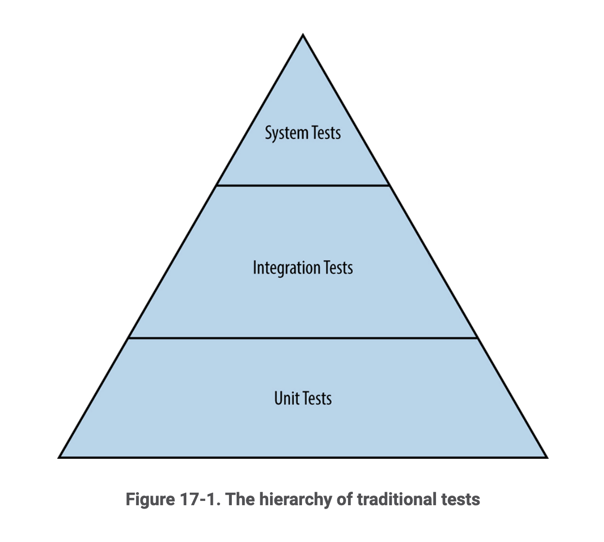

# Chapter 17: Testing for Reliability
## Overview
The primary responsibility of an SRE is to quantify the confidence in the reliability of a system by proactively testing the system both before and after changes are introduced. The amount of testing is dictated by the reliability requirements of the system in question, though in general the higher the percentage of the codebase and use cases covered by testing the less uncertainty there is in how the system will perform.

## Testing and Mean Time to Repair
Tests are an excellent, low friction way to detect potential failures before they affect customers. When a test fails it allows engineers to apply a fix prior to committing the code, resulting in a **zero** Mean Time to Repair (MTTR) bug. This also tends to increase the Mean Time Between Failures (MTBF) and encourages engineers to release code more frequently, which is the desired outcome for release engineering practices.

## Types of Testing
Software testing can be divided into two camp of testing: **traditional** and **production**, where the former is more common and consists of testing during the SDLC and the latter consists of testing on live systems to see how they behave.

### Traditional Tests
Traditional tests are fairly well understood amongst engineers, beginning with unit tests and layering in more complex tests.

#### Unit Tests
Unit tests are the most basic form of software testing and are usually used to introduce the concept of test driven development (TDD) into an organization. These tests exercise the contract of a single function or class independent of the rest of the application.

#### Integration Tests
Portions of the codebase that pass unit testing are then assembled into larger components and tested to ensure that those portions function as expected when joined. This often entails using dependency injection to mock parts of the system that are state dependent or more complex.

#### System Tests
System tests are the most complex test run on applications prior to deployment. These tests combine each of the components to test the end-to-end functionality of the entire system. These tests come in different flavors, each of which serves a specific purpose.

##### Smoke Tests
Smoke tests exercise the simplest and most critical end-to-end functionality. These tests are also commonly referred to as **sanity testing** and serve short-circuit additional, more expensive testing.

##### Performance Tests
Performance tests are another variant of system testing that aim to ensure that performance (i.e. latency) does not degrade over time as functionality changes and expands. For example, an application that initially only needed 8 GB of memory to serve requests in 10 ms may eventually need 32 GB of memory to serve the same request, else response time degrades to 100 ms. 

##### Regression Tests
Regression tests are meant to prevent previously encountered bugs from reappearing in the codebase. They can be thought of as a library of issues that historically caused the system to fail. Development teams can ensure that issues they have already spent time debugging do not recur by then encoding these issues into regression tests.

### Production Tests
Production tests interact with systems that are actively being used as opposed to hermetic testing environments. While inherently a bit more risky, these types of tests are fundamental to operating a reliable production system.

#### Stress Tests
Stress tests are written with the intention of finding the boundaries of an application or components of an application. In an ideal world all components that make up an application degrade gracefully, but in practice these components often have limitations to how much throughput, saturation, data corruption, etc. they can handle before failing catastrophically.

#### Canary Tests
Canary tests are not tests in the strictest sense of the word. Rather canary testing consists of upgrading a subset of servers to a new version or configuration of the application and then "baking the binary" or letting some production traffic reach the upgraded servers. In the event the traffic served by the new configuration or application introduced new failures or undesirable behavior, those servers are reverted and the code or configuration is reevaluated by the product development team.

## Creating a Test and Build System
Not all testing is created equally and while it can be satisfying to try to cover every unit of code with a test, this is often not the most effective strategy to increasing confidence in a test and build system. It can be helpful to ask:

- Is there a way to prioritize certain aspects of the codebase?
- Are there particular functions of classes that are mission-critical or business-critical without which the whole product falls apart?
- Which APIs are other teams integrating against?

Starting with a series of smoke tests that exercise the core functionality of a product on every code push is a great, low-cost, high-impact way to increase the level of confidence.

Documenting bugs as test cases is a more robust way to capture failures and ensure that they are fixed. Following this paradigm is a sure fire way to develop a comprehensive regression testing suite.

Create a flexible, extensible testing infrastructure creates the foundation upon which further testing can be built, enabling engineers to more easily test their code.
