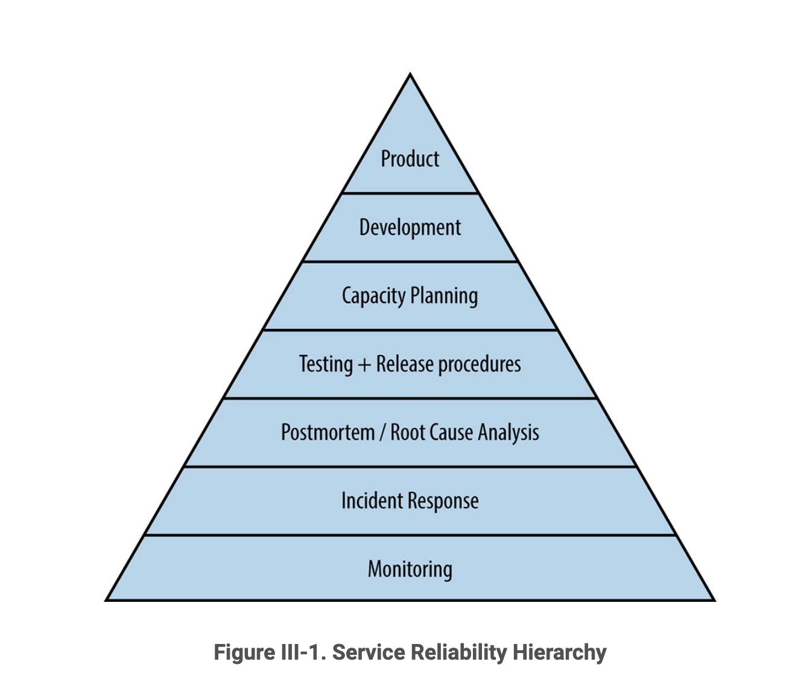

# Part III. Practices
## Overview
SREs are ultimately responsible for reliably operating services for customers, internal or external. The continued, healthy operation of software systems can be described as a series of requirements which build upon each other, starting with monitoring and ending with a full-fledged product.

- [Monitoring](./10-practical-alerting.md)