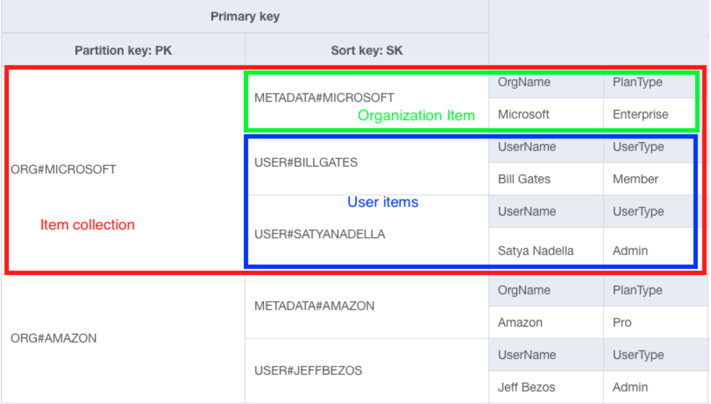
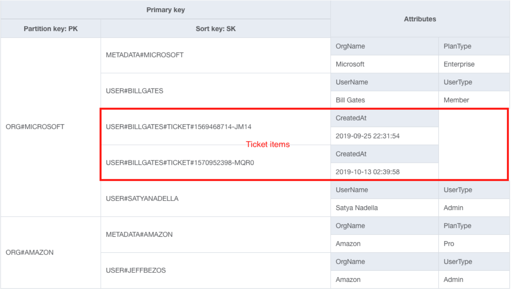
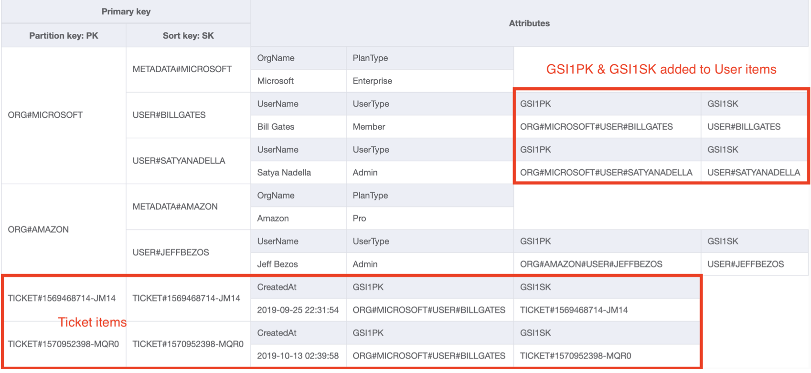
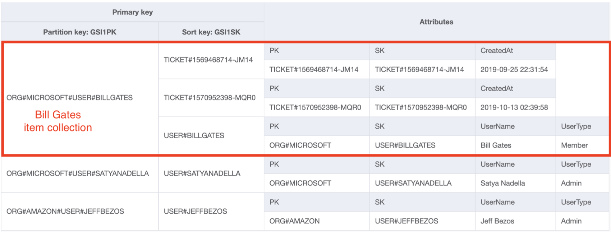
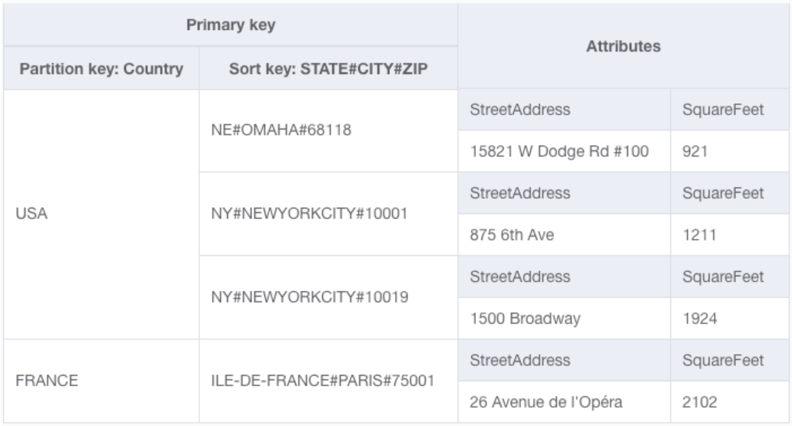

# Chapter 11: Strategies for one-to-many relationships
This chapter covers the various ways to model a parent-child, or one-to-many relationship. With one-to-many relationships, there is one recurring problem, which is how to fetch information about the parent entity when fetching one or more of the child entities. In relational databases there is really only one way to model this, while in DynamoDB there are a number of strategies that can be used to model and fetch one-to-many relationships.

## 11.1 Denormalization by using a complex attribute
The first way to denormalize with DynamoDB is to have an attribute that uses a complex data type, like a list or a map. This clearly violates the first tenet of database normalization, which thats that each attribute value must be atomic. Consider the example where there is a Customer entity which has many Address entities. In a relational database this would modeled with a foreign key called `CustomerId` on each `Address` entity. In DynamoDB, one way to achieve this is to have an `Addresses` attribute on the `Customer` entity, which is a map from the nickname of address to all pertinent data. Since the `Addresses` attribute contains multiple values it is no longer atomic, meaning the data is denormalized. Some considerations when deciding to handle a one-to-many relationship by denormalizing with a complex attribute are:

### Are there any access patterns based on the values in the complex attribute?
Complex attributes **cannot** be used in primary keys or secondary indices, so queries **cannot** be made based on the values in a complex attribute. In the example above, there are no access patterns that require fetching a `Customer` by their addresses.

### Is the amount of data in the complex attribute unbounded?
A single DynamoDB item cannot exceed 400KB of data, which means if the data is unbounded it is not a good fit for denormalization. In the example above, it is reasonable to limit the number of `Address` entities to 20 addresses, which makes it a good candidate for a complex attribute. In other examples, like an e-commerce application, the concept of `Orders` and `Order Items` can grow unbounded with respect to their parents, so they are **not** good candidates for complex attributes.

## 11.2 Denormalization by duplicating data
The second strategy for modeling one-to-many relationships again features denormalizing data, but this time by duplicating data across multiple records. This is an advantageous strategy when the information that is being duplicated will not be changing. The two main considerations for this strategy are:

### Is the duplicated information immutable?
If the duplicated information is immutable it is safe to duplicate it across many records.

### If the data does change, how often does it change and how many items include the duplicated information?
If the data changes fairly infrequently and the denormalized items are read *a lot* it is like okay to duplicate the data to save on subsequent reads. The caveat is that when the duplicated data *does* change it must be changed in all of the associated items. This leads to the second part of this consideration is how many items contain the duplicated data? If the data is being replicated to a few records, the cost of updating is negligible, but if it is replicated to thousands of records updating can become a headache.

## 11.3 Composite primary key + the Query API action
The third strategy for modeling one-to-many relationships -- and probably the most **common** way -- is to use a composite primary key plus the Query API to fetch an object and its related sub-objects. This utilizes the concept of *item collections*, which is any set of data that *shares* the same partition key. This necessitates using generic attribute names for the partition and sort keys and using the sort key to indicate the type of object. An example of how this would work for an `Organization` and `Users` is below:

This primary key design makes it easy to solve for four different access patterns:

1. **Retrieve an Organization** Use the `GetItem` API call with a PK of `ORG#<OrgName>` and a SK of `METADATA#<OrgName>`
2. **Retrieve an Organization and All Users** Use the `Query` API with a PK of `ORG#<OrgName>`
3. **Retrieve only the Users** Use the `Query` API with a key condition expression of `PK = ORG#<OrgName> AND beings_with(SK, "USER#")`
4. **Retrieve a specific User** Use the `GetItem` API call with a PK of `Org#<OrgName>` and a SK of `USER#<Username>`

While all of these access patterns are useful, the second is the most interesting as it relates to a one-to-many relationship. This is a pretty common way to model one-to-many relationships and will work for a number of situations.

## 11.4 Secondary index + the Query API action
The fourth strategy is very similar to the third, but uses a Global Secondary Index (GSI)  to fetch an item collection. This pattern may need to be used instead of the previous pattern if the primary keys in tables are reserved for another purpose, such as ensuring uniqueness on a particular property or because tables store hierarchical data with multiple levels. In the example above this would manifest as a `User` being able to save multiple items, say `Ticket` items. If these items are inserted at the same level as `User` our table now looks like:

But this add a bunch of additional data to the second access pattern above, most of which will likely be thrown away. One way to solve for this use case is to create separate item collections for each of the tickets by creating a new partition key for direct lookup of a ticket and creating a GSI, named `GSI1` with keys `GSI1PK` and `GSI1SK` and then populating values for both `Ticket` and `User` items where `GSI1PK` is `Org#<OrgName>#USER#<UserName>` essentially creating a new item collection with just users and tickets when querying `GSI`. This modifies the table to look like:

And to be restructured when querying against the GSI to look like:

Notice the new item collection with both the `User` and `Ticket` items side-by-side. This enables the access pattern discussed in the previous section.

## 11.5 Composite sort keys with hierarchical data
The last two strategies used examples with a couple levels of hierarchy, but what happens when there are more than two levels of hierarchy? Consider location-based data, that needs to be queryable on arbitrary geographic levels (e.g. by country, by state, by city, or by zip code). This can be solved using a composite **sort** key, which essentially means that a bunch of properties will be smashed together to allow different granularities in queries. Take this example where `state`, `city` and `zip code` have been combined to form a sort key:

This allows for searching at four levels of granularity (including the partition key of `country`) using just the primary key. The access patterns are:

1. **Find all locations in a give country** Use a `Query` with a key condition expression of `PK = <Country>`
2. **Find all locations in a given country and state** Use a `Query` with a key condition expression of `PK = <Country> AND begins_with(SK, '<State>#')`
3. **Find all locations in a given country, state, and city** Use a `Query` with a key condition expression of `PK = <Country> AND begins_with(SK, '<State>#<City>')`
4. **Find all locations in a given country, state, city, and zip code** Use a `Query` with a key condition expression of `PK = <Country> AND begins_with(SK, '<State>#<City#<Zip>')`

This strategy does not work in all scenarios, but in the right situations it works great. It works best when:

* There are many levels of hierarchy (i.e. >2) and there is a need for access patterns for different levels within the hierarchy
* Searching at a particular level in the hierarchy requires fetching all subitems for that level

## 11.6 Summary of one-to-many relationship Strategies
| Strategy   | Notes     |
|------------|-----------|
| Denormalize + complex attribute | Good when nested objects are bounded and are not accessed directly |
| Denormalize + duplicate | Good when duplicated data is immutable or infrequently changing |
| Primary key + Query API | **Most common.** Good for multiple access patterns for both the parent and related entities |
| Secondary index + Query API | Similar to primary key strategy. Good when primary key is needed for something else |
| Composite sort key | Good for deeply nested hierarchies with requirements to search through multiple levels of the hierarchy |
