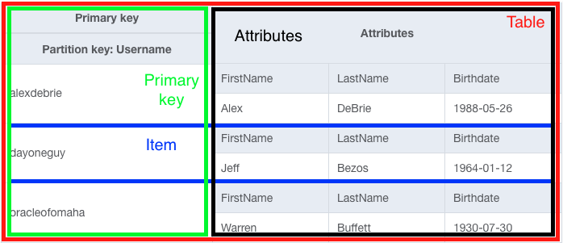
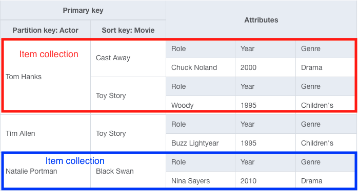

# Chapter 2: Core Concepts in DynamoDB
## Basic Vocabulary
There are five basic concepts in DynamoDB - tables, items, attributes, primary keys and secondary keys.
### Table
A table is a group of records that conceptually belong together.

DynamoDB tables differ from relational tables in that relationship tables only container **one entity** whereas multiple entity types can be stored in the same DynamoDB table. This avoids the `join` operations, which gets expensive as databases scale.

The second difference is that DynamoDB tables are **schemaless** which means that they do not have a schema that enforces the shape of the data being stored. This does **not** mean that the data should not have a schema, but rather that the schema should be enforced in the application code.
### Item
An `item` is a single record in a DynamoDB table.
### Attributes
A DynamoDB `item` is made up of many `attributes` which are typed data values. When writing items to a DynamoDB table, each attribute is given a specific type. There are **ten** different data types that fit into **three** categories
 - Scalars - a single, simple value of types `string`, `number`, `binary`, `boolean`, and `null`
 - Complex - the most flexible kind of attribute of types `lists` and `maps`
 - Sets - powerful component types that represent multiple, unique values of types `string sets`, `number sets`  and `binary sets`

### Primary Keys
All DynamoDB tables must declare a primary key. Each item in the table **must** include the primary key. If an item does not contain a primary key it will be rejected. If an item contains a primary key that already exists, it will overwrite that value (unless otherwise explicitly stated).

**NOTE** Primary key section and design is the most important part of data modeling in DynamoDB. Most data access is driven by primary keys, so they should be chosen wisely.
### Secondary Indexes
Secondary indexes allow data to be reshaped and represented in another format for querying. This enabled additional access patterns that may not be supported by primary keys. When creating a secondary index for a table, there must be a primary key, just like when the table is created.

## Primary Keys and Secondary Indexes
### Types of Primary Keys
In DynamoDB there are two kinds of primary keys:
- Simple Primary Keys - consist of a single element called a partition key
- Composite primary keys - consist of two elements, called a partition key **and** a sort key

**NOTE** A partition key is sometimes referred to as “hash key” and a sort key is sometimes referred to as a “range key”

A simple primary key enables fetching a single item at a time, which works well for one-to-one operations on individual items.

Composite primary keys enable fetching many items by utilizing the Query API and grabbing all items with the same partition key. Composite primary keys are great for handling relations between items in the data and retrieving multiple items at once.
### Types of Secondary Indexes
Secondary Indexes are similar to Primary Keys in that they also require a “key schema,” which is made up of a partition key and an optional sort key, and it will drive that specific access pattern. There are two kinds of secondary indexes in DynamoDB:
- Local secondary indexes
- Global secondary indexes

A local secondary index uses the same partition key as the table’s primary key **but** uses a different sort key. This is nice when filtering data by the same top-level property, but need different access patterns to further filter datasets.

A global secondary index allows for the use of any attributes for the partition and sort keys. Global secondary indexes are used much more frequently due to their increased flexibility.

A few other differences between the two include:
- Needing to provision additional throughput for a global secondary index that is separate from the core table’s throughput.
- With global secondary indexes, the only choice from a consistency perspective is **eventual** consistency since data is replicated from the core table to the secondary indexes **asynchronously**. Local secondary indexes allow for strong consistency, though they do consume more read throughput than EC reads.

In general, global secondary indexes (GSIs) are used more widely and are much more flexible.
## Item Collections
The concept of item collections is an under-discussed concept that is prevalent in DynamoDB. An “item collection” refers to a group of items that share the same partition key in either the base table or a secondary index.

In the example above there are three item collections, where the two rows for Tom Hanks make up an item collection with two items due to the shared primary key.

Item collections are important for two reasons:
- They are useful for partioning. DynamoDB partitions data across a number of nodes in a way that allows for consistent performance at scale with the caveat that **all items** with the same partition key will be kept on the same node.
- The Query API can be leveraged to allow for the retrieval of multiple items within a single item collection. This is an efficient and highly flexible operation and a lot of data modeling tips focus on creating the proper item collections.
