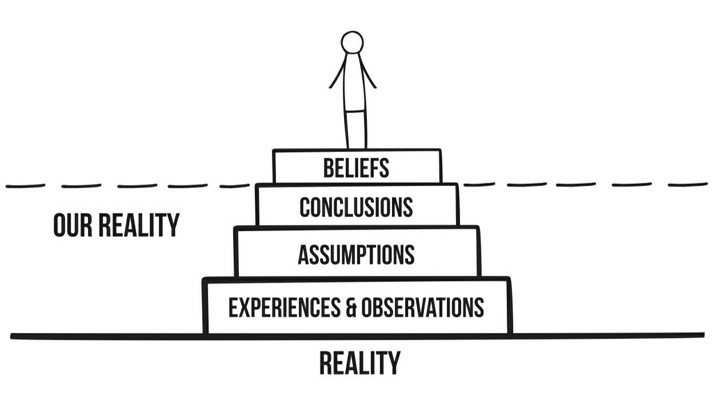

# This Naked Mind Notes
## Introduction
- Alcohol is a *dangerous* and *addictive* drug akin to nicotine, cocaine, and heroin. Thinking of it as drugs *and alcohol* where alcohol is in a category all its own is a delusion.
- There are innumerable rationalizations for why society endorses alcohol. Some of these rationalizations are to relieve stress, engage socially, or liven up a party.
- Alcohol makes no distinctions in terms of who and how it impacts. Often times the strongest, smartest, and most successful people are the most affected.

## 1. This Naked Mind: How and Why it Works
- **unconscious:** *un·con·scious* | /ənˈkänSHəs/ noun. The part of the mind that a person is not aware of but that is a powerful force in controlling behavior.
- The unconscious mind is responsible for and in control of all desires and is an overwhelmingly powerful force in controlling behavior.
- Change usually begins with a conscious thought, but requires altering unconscious beliefs and assumptions to truly take root. This can be achieved by educating the conscious mind.
- "Unconscious learning happens automatically and unintentionally through experiences, observations, conditioning, and practice."
- The mind is capable of burying morally reprehensible thoughts and even masking these thoughts by causing physical pain to distract through a process known as **amplification**. This process prevents "unacceptable" ideas from being examined and realized.
- The unconscious has no rationality. It is the domain of emotions and desires and is governed accordingly. When a conscious decision is made that conflicts with the emotions and desires harbored by the unconscious a cognitive dissonance is created.
- Society has conditioned the unconscious mind to believe alcohol provides pleasure, enjoyment, and support. In doing so it has entrenched alcohol in both social and stressful situations.
- Belief is built upon a foundation of `Experiences & Observations`. `Assumptions` are made from those `Experiences & Observations`. `Conclusions` are drawn from the `Assumptions`. `Conclusions` are drawn from the `Assumptions`. And finally `Beliefs` are formed out of the `Conclusions` that are reached, forming a self-specific semblance of reality.

- `Beliefs` are defined by [Dave Gray](https://www.linkedin.com/in/davegray/) to be the "things we know to be true", but these "things" are just an interpretation, a facsimile of reality, filtered through the layers listed above.
- Humans also tend to seek out `Experiences and Observations` that align with their beliefs, making those beliefs "self-sealing". This phenomenon is known as **confirmation bias.**
- Humans also attempt to protect their beliefs by consciously and unconsciously rejecting ideas that are incongruent to their beliefs. This rejection often does not allow for the testing and assimilation of new information that contradicts previously held beliefs.
- Bringing unconscious `Experiences and Observations` into the light of the conscious mind allows for the unconscious to change and assimilate these new experiences through the process of **neuroplasticity**.
- Alcohol is factually addictive. Full stop. It costs money, health, and relationships no matter who you are.

## 2. The Drinker or the Drink? Part 1: The Drinker
- The overwhelming sentiment in society is that the drinker is to blame for the inability to control drinking like "regular" drinkers. This inability is interpretted as a lack of willpower.
- Alcoholism is **not** defined by much or how often one drinks. There is no hard and fast definition for alcoholism.
- There are some loose correlations between genes and alcohol use, but there is no definitive causation behind those correlations.
- Since there is no specific, diagnosable defect of mind or body to which alcohol can be attributed it follows that **everyone** is susceptible to and on the path to alcohol dependence, albeit at different rates and with different experiences.
- A.A. touts the claim that alcoholism is a disorder or disease that they are powerless against. This claim allows for a separation between the addict and the "regular" drink that is mutually beneficial for both parties. "Regular" drinkers are able to use this belief as a buffer between their habits and those of the addicted, while addicts are able to place blame on their defect.

## 3. Part 2: The Drink
- In reality, alcohol is an addictive substance to which any human being can become addicted once enough has been consumed.
- This manifests in all drinkers through the systematic increasing of the amount of alcohol imbibed. Even the "regular" drinker often drinks more over long periods of time.
- Tolerance increases over time and with it the amount of alcohol needed to derive pleasure from the act of drinking.
- It stands that since alcohol is an addictive substance whose nature does not change based on who is drinking,
- and all humans are susceptible to addictive substances, that all humans are susceptible to alcohol addiction over a long enough period of sustained and increasing use.

## 4. Liminal Point: Is Drinking a Habit?
- "The chains of habit are too weak to be felt until they are too strong to be broken." - Samuel Johnson
- It is impossible to grok and assimilate **all** `Experiences and Observations` so both are filtered through a lens of relevance with those `Experiences and Observations` deemed irrelevant filtered out of the things we use to create our `Assumptions`, `Conclusions`, and eventually `Beliefs`.
- By definition, habits encourage you to not actively engage in the activity being performed. This removes the need to **consciously** evaluate in the activity at hand.
- Individuals may habitually drink, but drinking is **not** a habit, but rather an addiction, which most individuals not actively participating in how much, or often they drink.
- The consumption of alcohol is fueled by a fear that a piece of the human experience is irrevocably tied to the act of drinking and that removing that act will cause a constant unease and will be replaced by an inevitable unhappiness.

## 5. You: Simply Naked
- The body come fully equipped with two incredibly powerful guidance systems -- **symptoms** and **instincts** -- to help maintain homeostasis, defined as *"the maintenance of relatively stable internal physiological conditions (as body temperature or the pH of blood) in higher animals under fluctuating environmental conditions"*.
- **Symptoms** are the primary mechanism by which the body alerts the mind that some is not right, or out of homeostasis. The modern inclination is to dull these symptoms instead of heeding them, which can yield dangerous results.
- Humans are born with every instinct, hormone, and drug they need to live a long, healthy, and happy live.
- Pain is an incredibly important indicator of dangerous situations, but is often avoided at all costs. Pain keeps us from engaging in behaviors and doing things that could result in injury or even death.
- Repeated exposure to alcohol results in chronic fatigue and the normalization of stress and unhappiness. When compulsively drinking it is often challenging to manage stressful situations, resulting in the compounding of stress. 
- **Instincts** help us heed the symptoms, making sense of them and steering us clear of behaviors and situations that are harmful. Often these instincts are ignored in favor of using "intellect" to rationalize and explain away the instinctual response.
- Consuming alcohol and other drugs that deaden the ability to perceive symptoms and heed instinctual responses is reckless and can lead to dangerous situations and behaviors.

## 6. Liminal Point: Are We Really Drinking for the Taste?
- Early in life it is common to **observe** others seeming to enjoy the act of drinking, including the taste.
- Early **experience** was likely contradictory to this observation since alcohol is ethanol and is naturally unappealing to humans.
- But since the continued observation is that people seem to enjoy imbibing alcoholic drinks an **assumption** is formed that there must be something appealing about drinking.
- This yields a **conclusion** that drinking is a skill that must "be acquired," which is a self-fulfilling prophecy. 
- Humans know they need food and water to live. Other animals do not have this cognitive faculty, so they rely on their instincts more heavily for survival. In general, animals are drawn to consume things that smell and taste good to them. They are repelled from things that smell and taste bad.
- Alcohol naturally tastes bad to humans, so we apply processes and mix it with sugar to make it more palatable. This does not change the nature of the drink, which is harmful in all forms.
- Over time and exposure the senses are dulled to the unpleasantness of all things, alcohol included.
- The claim that alcohol can be paired with food to enhance the flavor is one of the greatest marketing ploys ever executed. Most restaurants make the lion's share of their money from high margin items, like cocktails and wine. In reality, alcohol dulls the senses, reducing the enjoyment of the naturally pleasurable act of eating. No added enjoyment to be had. 
- A beer on a hot day may sound good, but that may be because alcohol is a *diuretic* which naturally dehydrates and increases thirst. The dehydration that occurs from drinking can actually end up shrinking the brain, drastically impairing the ability for the brain to function.

## 7. You: Polluted
- There are many *studies* about the dangers of alcohol consumption, but relatively few *articles* since touting the dangers of alcohol just does not sell copies of popular publications. Articles that promote the possible linkage between alcohol and health benefits are far more popular, despite being less credible. This is another form of confirmation bias.
- A study was performed to measure the harm of several drugs to both the direct user and the indirect people affected by the use. Alcohol score as **the most** harmful drug, with a score of 72, compared to heroin, which came in second at 55, and crack cocaine, coming in third with a score of 54.
- On average, alcohol causes **twice** as many deaths as **all other drugs, both illegal and prescription, combined** in the United States each year.
- The consumption of alcohol slows the pace of communication between neurotransmitters in the brain. The *cerebellum*, *limbic system*, and *cerebral cortex* are the most susceptible systems. These systems are responsible for motor coordination, memory, emotional response, activity (including planning and social interaction), problem-solving, and learning.
- Alcohol also artificially stimulates pleasure and reward pathways, diminishing the ability to derive enjoyment from activities that were once found enjoyable (e.g. seeing a friend, reading a book, and having sex).
- Just **one bout** of heavy drinking can cause considerable and long-lasting alterations in nerve cells and reduce the size of individual brain cells.
- The liver is the first line of defense against alcohol, but when it breaks down alcohol it releases toxins and damaged liver cells into the blood stream, which are more dangerous than the alcohol itself. These toxins and damaged cells cause bad sleep, mood imbalance, and a whole host of emotional deficiencies. During this process the liver also become inflamed and over time scar tissue forms on the liver, affecting its ability to function properly and mucking with metabolism.
- *Abstinence* has been shown to reverse these affects, with the affects fully self-correcting over the course of several months to a year.
- When the **circulatory system** is polluted with the toxins and damaged cells it becomes "dirty." These toxins weaken the heart to the point of sagging and stretching and can even cause irregularities in the electrical signals that are responsible for the contraction and expansion of the heart, which can lead to blood clots and up to a 39% increase in the chance of stroke.
- Imbibing alcohol also releases stress hormones that constrict blood vessels, raising blood pressure, and creating hypertension in the body. 
- Alcohol wreaks havoc on the immune system, suppressing both the innate and adaptive systems by disrupting the production of cytokines, which are key in detecting, messaging, and fighting off infection.
- Alcohol is a known carcinogen and is linked to a significantly increased probability of developing certain cancers when consumed in **any amount**.
- Early death from alcohol has been linked to the loss of **2,400,000** hours of human life in the United States alone, with alcoholism reducing life expectancy by 10 - 12 years on average.

## 8. Liminal Point: Is Alcohol Liquid Courage
- **Observation:** alcohol used as liquid courage in film, advertisement, etc.
- **Assumption:** alcohol does provide courage
- **Experience:** drinking alcohol and having fear, doubt, and uncertainty subside
- **Conclusion:** alcohol does provide an extra dose of bravery
- Present day humanity has removed many of the everyday threats that our ancestors had to contend with. The result is a society in which fear is regarded as weakness, whereas, fear help us consider decisions more wholly and make better choices.
- Courage is doing what is right in spite of the fear of the ramifications. Alcohol is an anesthetic that numbs the nervous system and consequently the fear pathways in the brain, making it impossible to act courageously.
- Fear, apprehension, and uncertainty are uncomfortable feelings, but humans have evolved to have these feelings over generations because they are incredibly helpful in decision-making.
- Illegal drugs kill 327 people per week and prescription drugs kill 442 people per week. **Alcohol kills 1,692.**
- Bravery and cowardice are concepts that exist in humanity and nowhere else in the animal kingdom. True bravery does exist, but only in overriding fear to pursue what is morally right.

## 9. Oh S#*%! We're Stuck
- We have been conditioned to drink our entire lives. Whether we are being sold relaxation, sex appeal, or happiness, alcohol is more often than not included in the equation.
- The belief that advertising is not an influential force is the main reason that it is so effective. Unconscious efforts to influence often have a much larger magnitude than conscious efforts.
- Humans are not satisfied with merely existing. Unlike other animals we search for **meaning** in our existence which often leads to the creation of a void and an uncomfortable tension. This phenomenon is often referred to as *"the wound of existence."*
- Restlessness is merely part of existence, but many cannot bear the feeling and try to find a way to eliminate the discomfort of being idle. The nature of humans is to take the good and immediately bake it into our baseline. In general, **the more consumption the greater the desire for more.**
- Existential psychotherapist Irvin D. Yalom describes the humans "ultimate concerns" as death, isolation (loneliness), freedom, and meaning. These four concerns shape our deepest and most fundamental needs.
- "Alcohol advertisements sell an end to **loneliness**, claiming that drinking provides friendship and romance. They appeal to your need for **freedom** by saying drinking will make you unique, brave, bold, or courageous. They promise **fulfillment, satisfaction, and happiness**."
- In reality, alcohol is a foul tasting, addictive poison that reinforces its own need and wreaks havoc on the human body, literally sapping life force with every drop.
- Marketers sell the exact opposite. They sell relief from the human  condition, the wound of existence. They promise happiness, romantic relationships, and relaxation. In reality, alcohol brings pain, dysfunctional relationships, and stress.
- The advertising does not end with commercials and billboards. It is reinforced with each person who drinks and by a society that not only encourages drinking alcohol, but questions those that opt to not partake in the destructive pastime.

## 10. Liminal Point: Drinking Helps Me Loosen Up and Have Better Sex
- **Observation:** people who are normally reserved become rather boisterous and outgoing after a few drinks.
- **Assumption:** drinking alcohol is vital to "loosening up."
- **Experience:** inhibitions fading after drinking.
- **Conclusion:** drinking does remove inhibitions and loosens people up.
- In reality, alcohol merely removes inhibitions, which are a vital component in educated and effective decision-making. Inhibitions protect humans from both physical and psychological damage in most cases. By removing inhibitions we are effectively rendering ourselves vulnerable.
- In general, society regards introversion and inhibitions negatively, making it unpopular to live a life guided by our natural inhibitions.

## 11. A Quest for Sobriety
- *"Be patient with yourself. Self-growth is tender; it's holy ground. There is no greater investment." - Stephen Covey*
- The belief that quitting drinking alcohol is difficult reinforces the thought that alcohol holds power over us. The more thought dedicated to the difficulty, the harder it becomes to abstain.
- Rats, which are very similar to humans, will **not voluntarily** consume alcohol. They will only partake **after** being force-fed alcohol and developing a physical dependency.
- Similar to how believing advertising does not have an effect on us increases its efficacy, the fact that alcohol tastes foul increases our susceptibility to becoming addicted since we believe it would be impossible to become addicted to something that tastes so bad.
- The rest of the animal kingdom will quickly eschew any food or drink that does not appeal to their tastes. Humans are the only animal that will ignore their instincts in favor of their intellect.
- Abstaining from alcohol can be a very confronting and unpleasant thought for anyone who thinks that their life will never be as enjoyable without alcohol. The conscious and unconscious mind must confront and reject this thought for lasting and transformational change.

## 12. Liminal Point: I Drink to Relieve Stress and Anxiety
- **Observation:** people say they need a drink after a long day or a challenging experience.
- **Experience:** I have poured a drink to relax and unwind from a long day, even using a drink as a mental signal to mark the point in the day after which relaxation is acceptable.
- **Assumption:** drinking does create relaxation and relieves the mental burdens and anxieties of the day.
- **Conclusion:** alcohol is a necessary component of relaxation and stress relief.
- Relaxation can be considered having **nothing** that causes any worry or annoyance either physically or mentally.
- Alcohol may temporarily dull the awareness or things can are causing worry or annoyance, but it **does nothing** to remedy them.
- "Alcohol erases a bit of you every time you drink it. It can even erase entire nights when you are on a binge. Alcohol does not relieve stress; it erases your senses and your ability to think. Alcohol ultimately erases your self."
- Alcohol does not lead to real relaxation. Rather, it slows down brain function by affecting two neurotransmitters: glutamate and GABA. Glutamate is an *excitatory* neurotransmitter that increases brain activity and energy levels, the production and function of which is suppressed by alcohol. GABA is an inhibitory neurotransmitter, the production of which is increased by alcohol.
- Alcohol also triggers the compensatory systems in the body and mind, which seek to restore homeostasis by aggressively regulating the pleasurable effects of alcohol, namely dopamine.

## 13. The Mystery of Spontaneous Sobriety
- "Spontaneous sobriety" is the term used to refer to recovery from alcohol dependence without any formal treatment.
- The key to spontaneous sobriety is rectifying the cognitive dissonance created by wanting to quit drinking and the belief that life will never be quite as enjoyable without alcohol.
- People that recover through spontaneous sobriety have been proven to be more successful in maintaining a healthy relationship with alcohol than those who participate in programs. They appear to be more at peace with the decision.
- Many people have a conscious or unconscious belief that cutting off or limiting alcohol intake is a legitimate sacrifice and this creates a conflict with their desire to remove alcohol as an influence in their life.
- The conflict is physical in addition to mental when there is a dependency on alcohol, making the dissonance all the more powerful.
- Trying to quit drinking with sheer willpower is an incredibly challenging feat, especially since willpower is a finite resource. The most successful way to quit drinking is to first and foremost, change both your conscious and unconscious mind.

## 14. Liminal Point: I Enjoy Drinking; It Makes Me Happy
- **Observation:** people "enjoying" alcohol and imbibing freely and frequently, subscribing to the advertisements that promise relationship development and overall enjoyment.
- **Experience:** is that alcohol has been involved in many of my fondest memories and therefore must be related to bringing joy.
- **Assumption:** alcohol really does bring enjoyment and happiness to the lives of many, which contains an unspoken assumption that **not drinking** will bring unhappiness.
- **Conclusion:** alcohol oes in fact bring enjoyment and happiness.
- In reality, alcohol causes much of the unhappiness in our society. Not just to those that imbibe the alcohol, but also to those around them.
- Alcohol is both water and fat soluble, which means that it can be directly absorbed through the stomach lining and can easily pass between organs, including passing effortlessly through the blood-brain barrier.
- The rush from drinking comes on *quickly*, but dissipates equally quickly. The body immediately combats the rush of glucose (the immediate buzz) by releasing insulin, which causes blood sugar to dip, often creating an unpleasant feeling of emptiness and irritability.
- If alcohol was actually the source of happiness it would follow that each drink would lead to a sense of euphoria. In most cases this is not true, especially given the physiological impact of deadening the sense that alcohol has on the mind and body.
- The argument is often made that there are plenty of people with a glass in their hand that are laughing and seemingly having a good time. More often than not that is a result of the situation, the friends and conversation, and not the drink they are holding.
- Alcohol is such a hugely prevalent part of our society that it is more often present in social situations than it is absent, and thus the linkage between alcohol and enjoyable social situations is created and repeatedly reinforced.

## 15. Defining Addiction: Part 1
- Substance use disorders are evaluated based on three categories: **abuse**, **dependence**, and **craving**.
- **Abuse** is determined as substantial negative impacts to the addicted. These impacts can be health related, relational, or otherwise.
- **Dependence** occurs when the addicted is dependent either psychologically or physically or both on the drug. In these cases a tolerance is formed and withdrawal is experienced when the drug is not present. In other words the body and brain have changed to compensate for the chronic presence of the drug.
- **Craving** is the manifestation of extremely strong, albeit illogical, desire for the drug often in spite of conscious thought and willpower.
- More simply put, addiction is repeatedly engaging in something that you do not **want** to be doing because it is difficult to act in accordance with your conscious mind.
- Humans are an adaptive, and therefore addictive, species. Learning happens alongside addiction in the human brain. In other words, we learn to be addicted.
- The presence of a drug creates the continual need for it since as it leaves the system goes through withdrawal, a very unpleasant experience in which the brain and body are flushing the body of the toxins and adapting back to state prior to the introduction of the foreign drug. This often leaves the person with various feelings of emptiness, anxiety, and vulnerability.
- Most are happier with a drink not because the drink makes them happy, but rather because it **alleviates the unpleasantness of withdrawal.**

## 16. Liminal Point: Is Alcohol Vital to Social Life?
- **Observation:** alcohol present at every social situation with everyone partaking in the libations as a means of enjoying themselves.
- **Assumption:** alcohol is a necessity at all social events.
- **Experience:** alcohol serving as the focal point around which most social situations revolve.
- **Conclusion:** it's not a party unless the booze is flowing freely.
- Social activities have actually been shown to prevent addiction in rats who avoid drug-laced water when in a cage with other rats. However, when rats are isolated they showed a proclivity toward consuming the drug-laced water.
- The opposite is also true in many cases in that when the drug becomes more important than social interactions the social aspects of life tend to fade into the background and isolation takes place.
- Alcohol has been shown to result in a homogenization of life that renders all activities the same: drink, hangover, and repeat. The actual activity and the people present take on much less meaning in comparison with the drug.
- The brain plays a large role in affirming that alcohol is a necessity to enjoy a social activity. Merely by believing that alcohol is necessary, it becomes necessary in the mind's eye. Luckily, the converse is true as well.

## 17. Defining Addiction: Part 2
- Humans only crave things they believe to be beneficial. Addicts have merely developed the false belief that their drug of choice is beneficial to them.
- The brain attempts to maintain homeostasis in the body while drinking by releasing a chemical called **dynorphin**. This chemical manifests as "tolerance" and is the brain trying to mediate the effects of the alcohol. Unfortunately, the chronic release of dynorphin makes it much more challenging to enjoy other activities in life.
- Eventually this can lead to a state in which homeostasis can only be achieved with the presence of the drug, and thus the addicted is hooked. In other words, the drug artificially creates a low in the mood of the addicted, which can only be relieved by more of the drug. Or so the belief often goes.
- **Dopamine** also plays a large role in the development of addiction since alcohol and other addictive drugs trigger the release of dopamine. Dopamine does not have any pleasurable aspects unto itself, but rather controls the impulse to **seek rewards**. In other words, it is a key component in craving.
- Dopamine rich rats have been show to more aggressively seek rewards, but do **not** experience a greater level of pleasure than their dopamine poor peers.
- The ventral tegmental area (VTA) of the brain is primarily responsible for the release of dopamine and is one of three parts of reward processing: the VTA, nucleus accumbens, and prefrontal cortex. Liking and enjoyment occur in the nucleus accumbens.
- Watching a movie or having a good meal will stimulate the nucleus accumbens, but not nearly as directly or aggressively as drugs. Since they provide stimulus outside the normal ranges, the brain responds by producing CREB, which allows for the production of dynorphin. The dynorphin is a natural painkiller that inhibits the stimulation of the nucleus accumbens, leading to a return to homeostasis, but also creating tolerance and decreasing sensitivity to activities that are normally rewarding.
- The prefrontal cortex, which is responsible for decision-making, self-control, and the more reptilian functions, also changes with chronic alcohol exposure. Alcohol damages and thins the neuoral density in the prefrontal cortex, leading to diminished capacity to make good decisions.