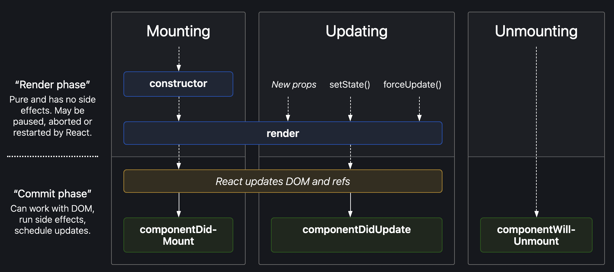

# Tips & Tricks
- Install the [React Devtool extension](https://chrome.google.com/webstore/detail/react-developer-tools/fmkadmapgofadopljbjfkapdkoienihi?hl=en)
- Embrace immutability. Avoid mutating state directly, opting instead to create copies and update the state using those copies of the data.
- Unlike the array `push()` method, the `concat()` method does not mutate the original array

# JSX
JSX is a _syntax extension_ for JavaScript, specifically written to be used with React. JSX is not valid JavaScript and needs to be compiled by a _JSX Compiler_ before it can be read by a web browser. A basic unit in JSX is called a _JSX element_. JSX elements are treated as JavaScript _expressions_ and can be inserted anywhere JavaScript expressions can go. The means that a JSX element can be stored as a variable passed to a function, stored in an object or array, etc.

It is important to note that React code can be written without using JSX at all. When a JSX element is compiled, the compiler transforms the JSX element into a call to `React.createElement()` and as such a React act can be written explicitly by making calls to `React.createElement()`. In face, eery JSX element is secretly a call to `React.createElement()`.

## Attributes
JSX elements can have attributes just like HTML elements. A JSX attribute is written exactly like an HTML attribute, with a name, an equal sign and then the value. **NOTE** The value *must always be wrapped in quotes (e.g. my-attribute-name="my attribute value")*.

## Template Literals
[Template literals](https://developer.mozilla.org/en-US/docs/Web/JavaScript/Reference/Template_literals) are string literals allowing embedded expression that are wrapped by backticks ('\`') and container one or more placeholders that are preceded by a dollar sign ('$') and wrapped in curly braces ('{}'). They looks like this:

\``string text ${expression} string text`\`

## Multi-line Expressions
It is very common to split JSX expressions that have multiple attributes and span multiple lines such that each attribute is on its own line. This significantly improves readability and makes it much easier to understand.

```
const panda = (
  
);
```

## Nested JSX
JSX elements can also be nested inside of each other, just like HTML elements. Nesting elements is often made more readable by using HTML-style line breaks and indentations.
```
<a href="http://mattforni.com">
  <h1>
    Link to mattforni.com
  </h1>
</a>
```

If a JSX element takes up more than one line, you must wrap the multi-line JSX element in parentheses. Parentheses are used around multi-line JSX expressions to prevent JavaScript from automatically inserting semicolons (based on rules given by the JavaScript specifications) to terminate statements.
```
(
  <a href="http://mattforni.com">
    <h1>
      Link to mattforni.com
    </h1>
  </a>
)
```

Nested JSX expressions can be saved as variables, passed to functions, etc. just like single line expressions.
```
const nestedExpression = (
  <a href="http://mattforni.com">
    <h1>
      Link to mattforni.com
    </h1>
  </a>
)
```

**NOTE** Every JSX expression must have *exactly one* outermost (or top-level) element. If a JSX expression has multiple outer elements, the solution is usually quite simple: wrap the JSX expression in a `<div>...</div>`.

## Rendering JSX
Rendering JSX means instructing the browser to display the JSX expression on the screen. The most common way to render JSX is to use the `ReactDOM.render(...)` method, which takes a JSX expression, creates a corresponding tree of DOM nodes, and then adds that tree of nodes to the DOM. That makes the JSX expression visible on the web page.

The first argument passed to `ReactDOM.render(...)` should always be the JSX expression to be rendered. The second argument is the HTML element to which the first argument should be appended. This elements usually selected using `document.getElementById(...)`.

**NOTE** The first argument passed to `ReadDOM.render(...)` should *evaluate* to a JSX expression. It does not have to explicitly *be* a JSX expression. The first argument could also be a variable, so long as that variable evaluates to a JSX expression.

**NOTE** One special thing about `ReactDOM.render(...)` is that it *only* updates DOM elements that have *changed*. That means that rendering the exact same thing twice in a row does not trigger a re-render for the second render. Only updating the necessary DOM elements is a large part of what makes React so successful. React accomplishes this thanks to something called *the virtual DOM*.

# Advanced JSX
## Gotchas
### `class` vs `className`
The `class` attribute is a reserved attribute used to denote elements are of a certain class. This means that JSX *cannot* use the `class` attribute and should instead use `className`, which will get converted to the `class` attribute when rendered.

### Self-Closing Tags
In HTML it is optional to include a forward slash (`/`) prior to the closing angle-bracket. In other words, both `<br>` and `<br/>` are perfectly legal. In JSX, the forward slash *must be included* or an error will be raised.

###  `if` Statements
`if` statements *cannot* be injected into JSX expressions under any circumstances. The reason why has to do with the way that JSX is compiled.

## JavaScript in JSX
Any code in between the tags of a JSX element will be read *strictly as JSX* unless otherwise instructed. JSX doesn’t add numbers - it reads them as text, just like HTML. JSX must be instructed to treat text as JavaScript, which it does by encapsulating the logic between curly braces (e.g. `{...}`).

## Variables in JSX
When JavaScript is injected into JSX, that JavaScript shares the environment with the rest of the JavaScript in that file. This means that all variables can be accessed with JSX expressions, even if they were defined outside of the scope.

### Variable Attributes
It is very common to use variables to set *attributes*. *Object properties* are also commonly used to set attributes on JSX expressions.

## Event Listeners in JSX
JSX elements can have event listeners just like HTML elements. Event listeners are bound to JSX elements by defining a *special attribute* on the JSX element (e.g. `onClick`, `onMouseOver`, etc.), most of which start with `on` followed by the type of event they are listening for. There is a full list of [supported events located here](https://reactjs.org/docs/events.html#supported-events). The value of these special attributes *should be a function handle*.

**NOTE** In HTML event listener names are written in all lowercase (e.g. `onclick`, `onmouseover`, etc.), but in JSX event listener names are written in `camelCase`.

## JSX Conditionals
One way to create conditional logic in React is to define `if` statements *outside* of JSX expressions. This is the most common way to represent conditionals in JSX.

### The Ternary Operator
A more compact way to represent conditionals is to use the *ternary operator*. The ternary operator works the same way in React that it does in JavaScript, but it is used much more regularly. At a high-level the ternary operator works as follows `const foo = x ? y : z` where `x` is an expression evaluated for truthy-ness, and if found truthy `foo` is set to `y`, else it is set to `z`.

### The `&&` Operator
Like the ternary operator, `&&` is not specific to React, but it used quite frequently within the framework. `&&` is best used in conditionals that will *sometimes do an action*, but other times *do nothing at all*. The `&&` operator can be used to only render a JSX element if some conditional is truthy, making it very powerful.

```
const tasty = (
  <ul>
    <li>Applesauce</li>
    { !baby && <li>Pizza</li> }
    { age > 15 && <li>Brussels Sprouts</li> }
    { age > 20 && <li>Oysters</li> }
    { age > 25 && <li>Grappa</li> }
  </ul>
);
```

## `.map` in JSX
The array method `.map` is also used quite heavily in React, particularly when it comes to creating a list of JSX elements. You can use this method to take a set of objects and easily turn them into JSX elements.

## JSK Lists and Keys
React utilizes the `key` property for lists in order to differentiate each item from its siblings. Keys are *not necessary* for all lists, but should be used when a list item must maintain state, or when the list must preserve order. Keys are also used to identity each component and differentiate it from sibling list items. Keys do *not need to be globally unique* but they should be unique amongst their siblings.

# Components
React applications are made out of components. A component is a small, reusable chunk of code that is responsible for one job. That job is often to render some HTML and is often defined via a JavaScript [class](https://developer.mozilla.org/en-US/docs/Web/JavaScript/Reference/Classes). The first step in defining any React component is importing the *React library* with the following code:

```
import React from 'react';
```

A similar import is necessary in order to allow the component to interact with the DOM:

```
import ReactDOM from 'react-dom';
```

All components have some methods and properties in common, so rather than rewriting those same properties again and again, components can extend from the `React.Component` class. Component class variable names must begin with capital letters and follow `UpperCamelCase` naming conventions.

```
class MyClass extends React.Component {
  ...
}
```

## The `render()` Method
*All* React components must define the `render()` method, which returns a JSX expression that represents how the component should appear on the screen. A `render()` function *must* have a `return` statement, but it can also contain simple calculations that need to happen right before a component renders.

## `this` in Components
The keyword `this` gets used a lot in React. When the keyword `this` is used within a component it is a reference to *an instance* of the component in which it is used.

## Event Listeners in Components
Render functions often contain event listeners that are being passed to child components. In React, you define event handlers as methods on a component class, like the following:

```
class MyClass extends React.Component {
  hovering() {
    alert('Stop it.  Stop hovering.');
  }

  render() {
    return (
      <div onHover={this.hovering}>
      </div>
    );
  }
}
```

## Getter Methods with `get`
Getter methods can be defined using the keyword `get`. When getter methods are defined this way, the trailing parentheses can be omitted when calling the getter method. Below is an example of a class that utilizes this pattern.

```
class NameComponent extends React.Component {
  get name() {
    return 'Name';
  }

  render() {
    return <h1>{this.name}</h1>;
  }
}
```

# Component Interaction
In React every JavaScript file in your application is invisible to every other JavaScript file by default. To use a variable that is declared in a different file simply import the file that includes the necessary functionality. Import statements where the string at the end begins with either a dot (e.g. `./`) or a slash (e.g. `/`) are treated as *filepaths*. For import statements that use filepaths, the file extension is assumed to be `.js` unless otherwise specified.

Before a variable can be imported from a different file, it must first be explicitly exported using the `export` keyword. The most common form or exporting is called “named exports” (which required wrapping imported names in curly braces) and it can be applied by prefacing any top-level (i.e. `var`, `let`, `const`, `function` or `class`) variable with the `export` keyword. Multiple variables can be exported from the same file.

A React component should use `props` to store information that can be changed, but can *only be changed by a different component*.

A React component should use `state` to store information that the *component itself can change*.

## `this.props`
Every component has an inherent object called `props`, which can be referenced via `this.props`. Information passed to a component on creation via attributes are stored in `props`. The most common use of using props is to pass information to a component, *from a different component*. It is particularly common to pass functions, namely event handlers, to a component as a prop.

### `defaultProps`
If a component expects specific props to be displayed, it can define a set of default props to ensure a consistent experience when expected props are not provided. The `defaultProps` property should be set to an `Object` with default properties set.

```
class Example extends React.Component {
  render() {
    return <h1>{this.props.text}</h1>;
  }
}

Example.defaultProps = {
  text: "Example Text"
};
```

### Naming Conventions
There are two names that must be chosen when defining attributes passed to children components, both of which are defined *in the parent component*. The first is the name of the variable/function and the second is the name of the prop that is passed to the child component. For event handlers in particular, there is a widely observed naming convention.

The convention for naming the event handler should reflect what type of event is being handled (e.g. if the event type is “click” then the event handler is `handleClick`). The convention for naming the prop is that the name of the prop should be the type of event being handled, preceded by `on`.

### `this.props.children`
Every component’s props object has a property named `children`. `this.props.children` will return everything in between a component’s opening and closing JSX tags.

## `this.state`
A React component can access dynamic information in two ways: `props` and `state`. Unlike `props` the `state` object is not passed to a component, but rather created and managed internally. The `state` property should be declared inside of a component's constructor method and all attributes should be given default values. To read a component’s state, use the expression `this.state.<name-of-property>`.

## Update `state` with `this.setState()`
A component can do more than just read its own state. A component can also change its own state by calling the function `this.setState()`. `this.setState()` takes two arguments:
1. an object that updates the component’s state (it does not need to contain keys and values for *all* state properties)
2. a callback (though the callback is almost never used)

**NOTE** `this.setState()` takes an object, and *merges* that object with the component’s current state. `this.setState()` also cannot be called from inside of the `render` function because `this.setState()` implicitly calls `this.render()` upon completion and if the latter called the former explicitly it would create an *infinite loop*.

```
class MyClass extends React.Component {
  constructor(props) {
    super(props);
    this.updateState = this.updateState.bind(this);
  }

  updateState() {
    this.setState({
        ...
    });
  }

  ...
}
```

## Child Updating Parents' State
A child component updates the state of the parent component via a function that the parent defines. The parent defines a function that calls `this.setState()` and then in the constructor binds the function to the current instance of the parent. With that done the parent passes the function to the child as one of the child's `props`. Then the child can call that function whenever the parent needs to update state.

It should be noted that child components often cannot used the passed function directly since the listener has an event, so it must often defines *another* function that uses the event to extract the pertinent information and call the change function the parent passed down.

**NOTE** When writing a component class method that uses `this`, then the appropriate `this` must be bound to that method inside of the constructor function.

## Separation of Concerns
In React it is a best practice to ensure each component only has one job. This means if there is a component that both displays some data and provides an input to modify that data, it should probably be split into two different components. This means having:

- one stateless component display information
- one stateless component offer the ability to change that information

## Controlled versus Uncontrolled Components
An *uncontrolled component* is a component that maintains its own internal state. A *controlled component* is a component that does not maintain any internal state. Since a controlled component has no state, it must be controlled by another component. A controlled component has no memory and any queries to that component will have to be made through `props`. Most React components are controlled.

In React, when you give an `<input />` a value attribute, then something strange happens: the `<input />` becomes controlled, which is a more "React" way of doing things. There is more information in the [React forms documentation](https://reactjs.org/docs/forms.html).

### Container Components versus Presentational Components
Separating container components from presentational components is a popular React programming pattern. In other words, if a component has to have state, make calculations based on props or manage any complex logic then that component **should not** also have to render HTML-like JSX. The *functional* part of a component (e.g. state, calculations, etc.) is often separated into a *container component*.

The presentational component’s *only job* is to contain HTML-like JSX. It should be an *exported component* and will not render itself because a presentational component will *always* get rendered by a container component.

Say there is are `Presentational` and `Container` components. `Presentational.js` must export the component class (or function, when applicable):

```
export class Presentational extends Component {
  ...
};
```

and `Container.js` must then import that component:

```
import { Presentational } from 'Presentational.js';

class Container extends Component {
  ...
  render() {
    return  <Presentational />;
  }
}
```

**NOTE** Any component that gets rendered by a different component should use `export`.

In this programming pattern, the container component does the work of figuring out what to display. The presentational component does the work of actually displaying it. If a component does a significant amount of work in both areas, then it should use this pattern!

# Component Lifecycle
React components have several methods, called *lifecycle methods*, that are called at different parts of a component’s lifecycle. Two of these lifecycle methods are the `constructor()` and `render()` methods, the former of which is only called during mounting and the latter is called at the conclusion of mounting, and during the updating phase. Components have three high-level parts:

1. *Mounting*   - when the component is being initialized and put into the DOM for the first time
2. *Updating*   - when the component updates as a result of changed state or changed props
3. *Unmounting* - when the component is being removed from the DOM



## The Mounting Phase
The mounting phase is the phase during which a component is created and initially rendered. During this phase there are several methods that are called:

1. `constructor()`
2. `getDerivedStateFromProps()` - **NOTE** this method is rarely used by developers
3. `render()`
4. `componentDidMount()` - **NOTE** this method is good for starting side-effects (e.g. timers, etc.)

**NOTE** In general, when a component produces a side-effect, you should remember to clean it up.

## The Updating Phase
An update is triggered by any changes to `props` or `state`. When a component updates it [calls several methods](https://reactjs.org/docs/react-component.html#updating), but there are only two that are commonly used: `render()` and `componentDidUpdate()`. The latter is a good place for any update-phase work that needs to be performed. The `componentDidUpdate()` function takes one argument, `prevProps`, which represent the `props` the component had *the last time it was rendered*.

## The Unmounting Phase
The unmounting phase is the opposite of the mounting phase and is called when the component is be removed from the DOM. Right before the component is completely destroyed the method `componentWillUnmount()` which is a useful time to clean up any side-effects the component initiated.

# [Function Components](./markdown/function-components.md)

## Hooks
### Rules of Hooks
There are two main rules to keep in mind when using hooks:

1. *Only* call Hooks at the top level
2. *Only* call Hooks from React functions

These rules are fairly simple to follow when using the state and effect Hooks, but there are plenty [more Hooks](https://reactjs.org/docs/hooks-reference.html) to which these rules also apply. This means never calling Hooks from inside of conditional statements, loops or any other sorts of functions. It is also important to make sure Hooks are *never used* in conjunction with classes or regular JavaScript functions.

### [The Effect Hook](./markdown/the-effect-hook.md)

## Advanced React
### [Styles](./markdown/styles.md)
### [`propTypes`](./markdown/prop-types.md)

# Terminology
## Controlled Component
A child component that receives values from the parent component and inform the parent component when it is interacted with.

## Function Component
Function components are a simpler way to write components that only contain a render method and do not have their own state so that it does not need to extend `React.Component`. Instead it is just a function that takes `props` as input and returns what should be rendered.

# Sources
- [Tutorial: Intro to React](https://reactjs.org/tutorial/tutorial.html)
- [Codeacademy: React 101](https://www.codecademy.com/learn/react-101)
