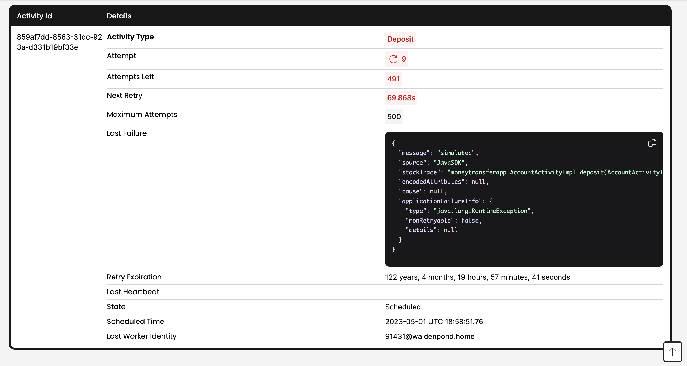

# Overview
- Temporal is a "developer-first, open source platform that ensures the successful execution of service and applications." 
- Getting an instance of the Temporal server/cluster up and running is super easy following the [dev environment](https://learn.temporal.io/getting_started/java/dev_environment) instructions. Nice!

## Getting Started with Temporal
### Set up your development environment
- I chose to do the tutorials in Java since that is the language with which I have the most experience.
- Start by installing the JDK. The tutorials were produced using Java SE 19.0.2
- I downloaded Java SE 20.0.1 compiled as a DMG for the x64 macOS architecture. 
- The Java project instructions assume some existing knowledge of JDKs, IDEs, etc. They could benefit from improved instructions with step-by-step instructions paired with screenshots.
- The "learn" artifacts could also benefit from OS specific installation processes. I would say they are "bare bones" right now. If the sales motion is bottom up need to make these instructions idiot-proof or will see abandonment.

#### [Configure Gradle](https://learn.temporal.io/getting_started/java/dev_environment/#configure-gradle)
- "Add the following lines to your Gradle configuration file, build.gradle, to configure the Temporal SDK." -> Add them to the `dependencies` section of`build.gradle`

### [First Program in Java](https://learn.temporal.io/getting_started/java/first_program_in_java/)
#### Goals
- Complete several runs of a Temporal Workflow application using the Temporal server and the Java SDK.
- Practice reviewing the state of the Workflow.
- Understand the inherent reliability of Workflow functions
- Learn many of Temporal's core terminology and concepts.
#### Notes
- "You can think of Temporal as a sort of "cure all" for the pains you experience as a developer when trying to build reliable applications." -> Stronger wording
- This project mimics a "money transfer" application with one **Workflow** and two **Activity** functions. This workflow withdraws money from one account and deposits it into another.
- To trigger the execution of the transfer of funds, send a **Signal** to the Temporal server, which then queues work to be done.
- A **Worker**, which wraps the compiled Workflow and Activity functions picks up the work and executes it, communicating the results back to the Temporal server.

- **VP** Retry Options are set on a per-activity basis, which is not usually something you can get for free, or so easily via client.

#### The Workflow Function
The **Workflow** function is the _entry point_ to the application. When a **Workflow** is "started" the Temporal server begins tracking the state of the **Workflow** with the matching function signature. The **Worker** executes the code and transmits the state transitions back to the Temporal server for reliability and durability purposes.

#### Initiate Transfer
There are two ways to start any workflow, either via the CLI or the SDK. The SDK is the primary way that Workflows get started in live, production environments. The signal to the Temporal server can be sent synchronously or asynchronously.

- Why is there a link to the [Workflows in Java](https://legacy-documentation-sdks.temporal.io/java/workflows) page instead of the vanilla [Workflow](https://docs.temporal.io/workflows) page? Also, this does not link to anything referencing the difference.
- When would it be advantageous to send a sync versus async workflow signal?

#### State Visibility
- I really like being able to see that no instances of **Worker** are active. I think that is a nice touch and step.
- Seeing the timeout configuration and retry options is not immediately apparent in the UI.
- **VP** Get a "Task Queue" for free to manage the state and transitions instead of need to create for self.

#### The Worker
The **Worker** actually executes the work specified in the **Workflow**, which is broken up into tasks and put into the Task Queue for execution. A **Worker** can only execute code that is in the Task Queue to which it has been registered. The **Worker** returns results to the Temporal server after it has completed executing tasks. 

- A worker can have implementations for both workflows and activities.
- Task Queues are merely defined by a String.
- Why does the Java worker have a method for registered workflow class types, but activities implementations?
- **VP** Claims that one of the value props is the insight in to the execution of the workflow, but I would argue the execution of the workflow is very opaque at least via workflow history.
- Could offer a whole tutorial on how to read the workflow history.
- What happens if I register a **Worker** to a task queue for which it has no implementations? Will I then have a **Worker** polling my Task Queue, but unable to process any of the workflow or activity tasks.

#### Failure Simulation
One of the other major value propositions is maintaining the state of the workflow execution, even in the face of failures.

- Claim that "many modern applications require complex leader election processes and external databases to handle failures." Temporal, on the other hand preserves state "even if the server is down."
- Can test this by starting a **Workflow** and then killing the Temporal server.
- **ACT** This example **did not** work for me. I had no workflows when I restarted my server.
- This is a pretty big miss on showing off the value proposition IMO. This needs to be rectified.

The execution should also be able to recover gracefully from an Activity error. This can be simulated by [throwing an exception in Java](https://learn.temporal.io/getting_started/java/first_program_in_java/#recover-from-an-activity-error).

- This is a very powerful illustration of the ability to retry an execution, but it might be made more powerful by adding randomness to the success of the function and by pulling in the maximum number of executions.
- Also, and this is more geared toward the product, but it can be challenging to interpret what the UI is conveying regarding the retry logic.

- The UI link in this section points to `localhost:8080`, but the default port is `8233` so it does not go anywhere.

The instruction is then to fix the offending code by re-commenting the exception code and restart the **Worker**. It is actually **very** cool to be able to update code on the fly. Very cool value proposition.

- This is a transactional workflow though. We want to re-deposit the amount we withdrew from the first account if we are not able to deposit it into the other account. Is there a way to extend this example to have another step prior to repairing the activity that shows the ability to process in an _atomic_ way?